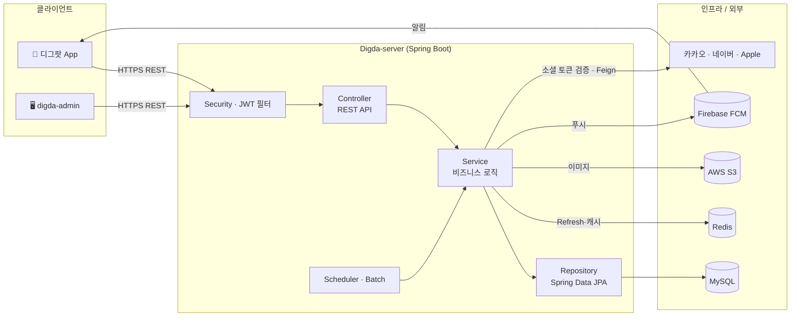
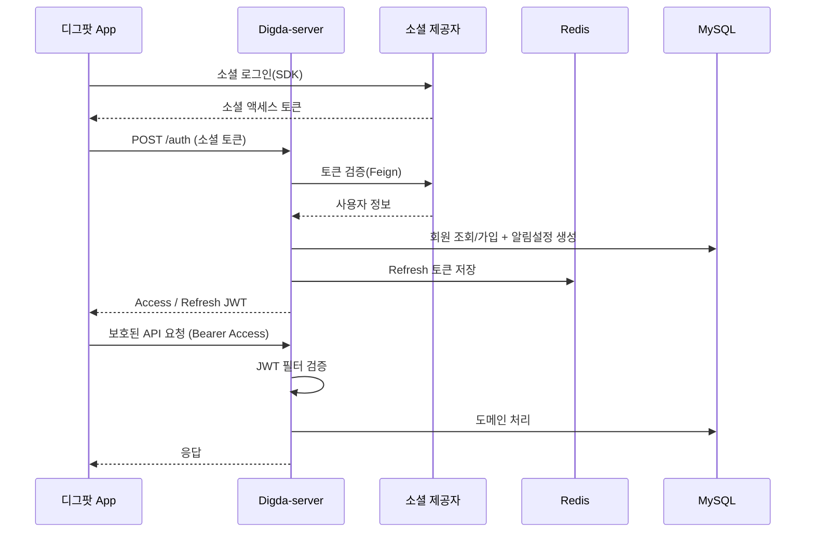
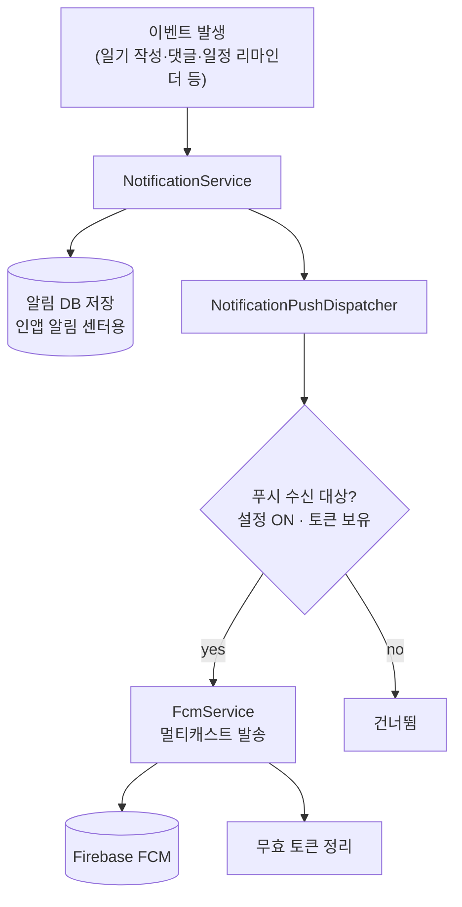
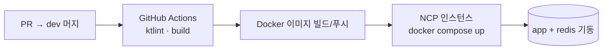

<div align="center">

# 🍙 Digda-server

**디그팟(DigPot · 디지털 그룹 포켓)** 백엔드 API 서버

비공개 그룹 다이어리 앱 [디그팟](https://github.com/DateDiary/Digda-app)의 인증·그룹·일기·일정·캐릭터·알림을 담당하는 Spring Boot 서버입니다.

[](https://kotlinlang.org)
[](https://spring.io)
[](https://www.mysql.com)
[](https://redis.io)
[](https://www.docker.com)

운영사 **태리팟(Taeripot)** · 앱 [Digda-app](https://github.com/DateDiary/Digda-app) · 관리자 [digda-admin](https://github.com/DateDiary/digda-admin)

</div>

---

## 📖 개요

Digda-server 는 모바일 앱(디그팟)과 관리자 대시보드(digda-admin)에 REST API 를 제공하는 단일 백엔드입니다.
소셜 로그인 기반 인증, 그룹방 단위의 일기·일정·투두·캐릭터 도메인, FCM 푸시 알림, 이미지 업로드(S3),
정기 리마인더 배치를 담당합니다.

- **인증**: 카카오 · 네이버 · Apple 소셜 로그인 → 자체 JWT(Access/Refresh) 발급
- **도메인 API**: 그룹방 · 그림일기 · 일정 · 댓글 · 투두 · 캐릭터(모찌)/퀴즈 · 알림
- **푸시**: Firebase Admin SDK(FCM) 멀티캐스트 + 인앱 알림 저장
- **스케줄러**: 일정 리마인더(KST 09/12/18시), 그룹 삭제 예약 정리
- **관리자 API**: 대시보드 통계·공지·유저/콘텐츠 관리(`/admin/**`)
- **API 문서**: springdoc OpenAPI(Swagger UI)

---

## 🛠️ 기술 스택

| 구분 | 사용 기술 |
|---|---|
| **언어 / 프레임워크** | Kotlin, Spring Boot 3 (Web, WebFlux) |
| **데이터** | Spring Data JPA, MySQL 8, Spring Data Redis(Refresh 토큰·캐시) |
| **인증/보안** | Spring Security, OAuth2 Client, JWT(jjwt 0.12) |
| **외부 연동** | OpenFeign(소셜 토큰 검증), Firebase Admin(FCM), AWS S3(이미지) |
| **배치/스케줄** | Spring Batch, `@Scheduled` (리마인더·정리 잡) |
| **문서화** | springdoc-openapi (Swagger UI) |
| **기타** | jsoup · Selenium(HTML→PDF 문서 생성) |
| **빌드/품질** | Gradle(Kotlin DSL), ktlint, spotless |
| **배포** | Docker, docker-compose, GitHub Actions → NCP |

---

## 🏗️ 시스템 아키텍처



### 인증 & 요청 데이터 흐름



### 알림(FCM) 발송 흐름



---

## 🧩 주요 모듈 (도메인)

`src/main/kotlin/digdaserver` 하위는 **도메인 패키지** + **global(공통)** 으로 구성됩니다.

| 도메인 | 책임 |
|---|---|
| `oauth2` | 소셜 로그인(카카오/네이버/Apple), JWT 발급·재발급, 계정 |
| `user` | 프로필, 알림 설정, 개인정보 설정 |
| `group_room` | 그룹방 생성/조회/홈 집계, 삭제 예약·복구, 방장 양도 |
| `membership` | 그룹 구성원 관리, 강퇴/탈퇴 |
| `invite` | 초대 코드 발급/참여 |
| `diary` | 그림일기(하루 1편), 캘린더 집계·통계 |
| `schedule` | 일정 CRUD, 캘린더 조회, 리마인더 스케줄러 |
| `comment` | 일기·일정 댓글 |
| `todo` | 그룹 투두리스트 |
| `character` | 모찌 캐릭터(경험치·진화), 퀴즈, 상점/꾸미기 |
| `notification` | 알림 생성·조회·읽음, 푸시 디스패치 |
| `device` | FCM 디바이스 토큰 등록/해제 |
| `upload` | 이미지 업로드(S3 presign 등) |
| `announcement` | 공지 발송 |
| `log` | 사용자 활동 로그 |
| `global` | `config`(보안/CORS/Swagger), `infra`(fcm/s3/feign), `jwt`, `common`(예외/페이지네이션) |

각 도메인은 `presentation(controller·dto) · application(service) · domain(entity·repository)` 레이어로 나뉩니다.

---

## 🔌 API 한눈에 보기

| 그룹 | 대표 엔드포인트 |
|---|---|
| 인증 | `POST /auth`, `POST /auth/reissue`, `POST /logout` |
| 그룹방 | `GET /group-rooms`, `GET /group-rooms/{id}`, `GET /group-rooms/{id}/home` |
| 초대/구성원 | `POST /invites`, `POST /invites/{code}/join`, `GET /memberships` |
| 일기 | `GET /diaries/calendar`, `POST /diaries`, `GET /diaries/{id}` |
| 일정 | `GET /schedules`, `POST /schedules`, `GET /schedules/{id}` |
| 댓글 | `POST /schedules/{id}/comments`, `POST /diaries/{id}/comments` |
| 캐릭터/퀴즈 | `GET /characters`, `GET /character-quizzes/random`, `POST /character-quizzes/{id}/attempt` |
| 알림/기기 | `GET /notifications`, `POST /devices` |
| 관리자 | `/admin/**` (대시보드·공지·유저/콘텐츠 관리) |

> 전체 스펙은 서버 기동 후 **Swagger UI** (`/swagger-ui/index.html`) 에서 확인하세요.

---

## 🚀 로컬 실행

### 사전 요구사항
- JDK 17
- MySQL 8, Redis (로컬 또는 docker-compose)
- 환경변수/시크릿: DB 접속, JWT 시크릿, 소셜 키, AWS S3, Firebase 서비스 계정

### 실행
```bash
# 빌드 (테스트 제외)
./gradlew clean build -x test

# 코드 스타일 (커밋/PR 전 필수)
./gradlew ktlintFormat

# 실행
./gradlew bootRun
```

### Docker
```bash
docker compose up -d        # app + redis 기동
```

---

## ⚙️ 배포

- GitHub Actions(`.github/workflows/deploy.yml`)가 `dev` 머지 시 CI(ktlint·build) → Docker 이미지 빌드/푸시 → **NCP 인스턴스** 배포를 수행합니다.
- 배포 이미지: `chltmdgh522/digda:latest` (app) + `redis` (docker-compose).
- 운영 DB 는 `ddl-auto=none` — 스키마 변경은 `SchemaAutoMigration` 에 ALTER 정의를 추가해 반영합니다.



---

## 🤝 협업 / 컨벤션

- 통합 브랜치 **`dev`**, PR base 는 `dev` (`main` 직접 승격 금지).
- 이슈/PR 템플릿: `.github/ISSUE_TEMPLATE/`, `.github/PULL_REQUEST_TEMPLATE.md`
- 라벨(Type/Priority/Status/Domain)·마일스톤·담당자 정책은 조직 공통 가이드를 따릅니다.
- 커밋 컨벤션(AngularJS 스타일):

| Type | 설명 |
|------|------|
| feat | 새로운 기능 추가 |
| fix | 버그 수정 |
| docs | 문서 수정 |
| style | 포맷 변경(기능 영향 없음) |
| refactor | 기능 변경 없는 구조 개선 |
| test | 테스트 추가/수정 |
| chore | 빌드·설정·유지보수 |

---

<div align="center">
<sub>© 2026 태리팟(Taeripot) · 디그팟(DigPot) — Digital Group Pocket</sub>
</div>
