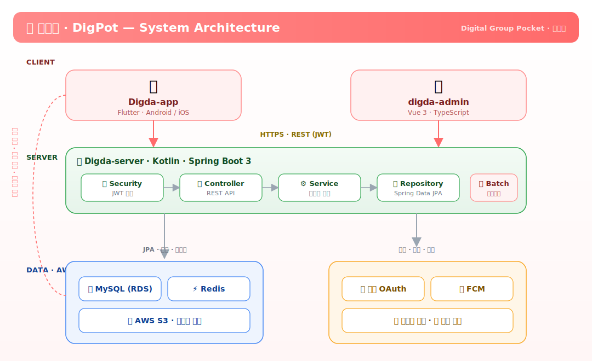
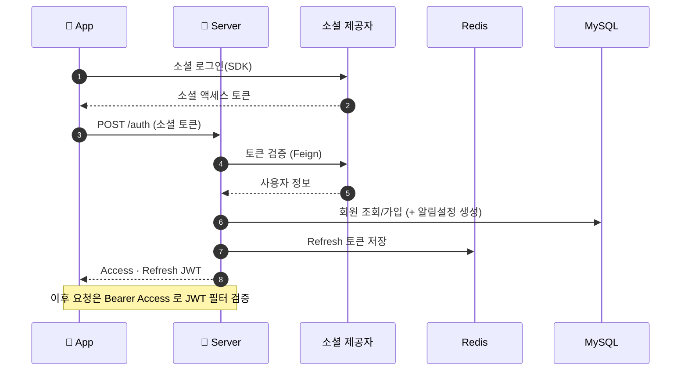
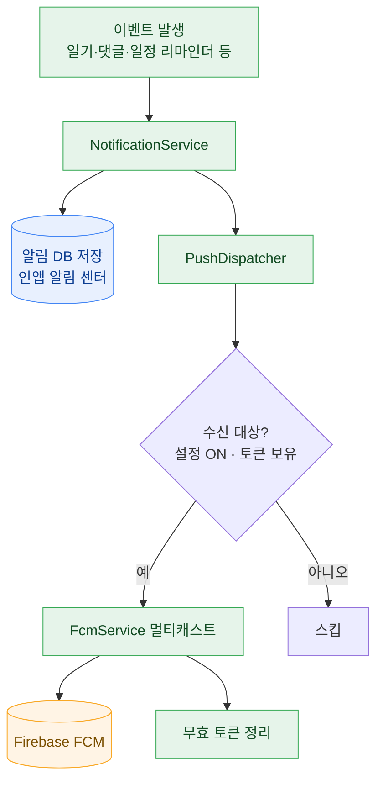
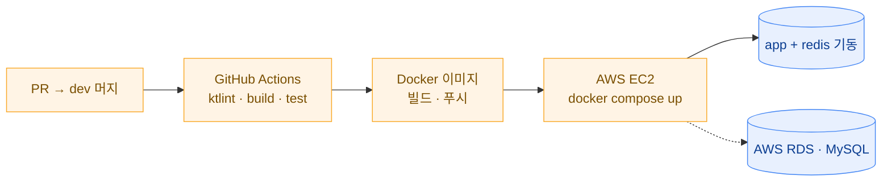

# 🍙 Digda-server

**디그팟(DigPot · 디지털 그룹 포켓)** 백엔드 API 서버

운영사 **태리팟(Taeripot)** · 앱 [Digda-app](https://github.com/DateDiary/Digda-app) · 관리자 [digda-admin](https://github.com/DateDiary/digda-admin)

> 본 문서는 **내부 개발자·운영 담당자용** 안내입니다. 서버 구조와 데이터 흐름을 빠르게 파악하는 데 초점을 둡니다.

---

## 📖 개요

모바일 앱(디그팟)과 관리자 대시보드(digda-admin)에 REST API 를 제공하는 단일 백엔드입니다.
소셜 로그인 기반 인증, 그룹방 단위의 일기·일정·투두·캐릭터 도메인, FCM 푸시 알림,
이미지 업로드(S3), 정기 리마인더 배치를 담당합니다.

---

## 🛠️ 기술 스택

| 구분 | 기술 |
|---|---|
| 언어·프레임워크 | Kotlin · Spring Boot 3 (Web, WebFlux) |
| 데이터 | Spring Data JPA · MySQL 8 · Redis(Refresh 토큰·캐시) |
| 인증·보안 | Spring Security · OAuth2 Client · JWT(jjwt) |
| 외부 연동 | OpenFeign(소셜 검증) · Firebase Admin(FCM) · AWS S3 |
| 배치·스케줄 | Spring Batch · `@Scheduled`(리마인더·정리) |
| 문서화 | springdoc-openapi (Swagger UI) |
| 빌드·품질 | Gradle(Kotlin DSL) · ktlint · spotless |
| 배포 | Docker · GitHub Actions → AWS (EC2 · RDS · S3) |

---

## 🏗️ 시스템 구성도

  

## 🔐 인증 흐름 (소셜 로그인 → JWT)

## 🔔 알림(FCM) 발송 흐름

---

## 🧩 도메인 모듈

`src/main/kotlin/digdaserver` = 도메인 패키지 + `global`(공통). 각 도메인은
`presentation(controller·dto) · application(service) · domain(entity·repository)` 레이어로 나뉩니다.

| 도메인 | 책임 |
|---|---|
| `oauth2` | 소셜 로그인, JWT 발급·재발급, 계정 |
| `user` | 프로필, 알림/개인정보 설정 |
| `group_room` | 그룹방 CRUD·홈 집계, 삭제 예약·복구, 방장 양도 |
| `membership` · `invite` | 구성원 관리(강퇴/탈퇴) · 초대 코드 |
| `diary` · `schedule` · `comment` | 그림일기(캘린더 집계) · 일정(리마인더 스케줄러) · 댓글 |
| `todo` · `character` | 그룹 투두 · 모찌(경험치·진화·퀴즈·상점) |
| `notification` · `device` | 알림 생성·푸시 디스패치 · FCM 토큰 |
| `upload` · `announcement` · `log` | S3 업로드 · 공지 · 활동 로그 |
| `global` | `config`(보안/CORS/Swagger) · `infra`(fcm/s3/feign) · `jwt` · `common` |

---

## 🔌 API & 문서

| 그룹 | 대표 엔드포인트 |
|---|---|
| 인증 | `POST /auth` · `POST /auth/reissue` · `POST /logout` |
| 그룹방 | `GET /group-rooms` · `GET /group-rooms/{id}` · `GET /group-rooms/{id}/home` |
| 일기·일정 | `GET /diaries/calendar` · `POST /diaries` · `GET /schedules` · `POST /schedules` |
| 캐릭터 | `GET /characters` · `GET /character-quizzes/random` |
| 알림·기기 | `GET /notifications` · `POST /devices` |
| 관리자 | `/admin/**` |

> 전체 스펙은 **Swagger UI** (`/swagger-ui/index.html`).

---

## ⚙️ 배포 아키텍처

`dev` 머지 시 GitHub Actions 가 CI(ktlint·build) → Docker 이미지(Docker Hub) 빌드/푸시 → **AWS EC2** 에 SSH 접속해 `docker compose` 로 배포합니다. DB 는 **AWS RDS(MySQL)**, 이미지 저장은 **AWS S3** 를 사용합니다.
운영 DB 는 `ddl-auto=none` — 스키마 변경은 `SchemaAutoMigration` 에 ALTER 정의를 추가해 반영합니다.

---

## 🤝 협업 / 컨벤션

- 통합 브랜치 **`dev`** · PR base 는 `dev` (`main` 직접 승격 금지)
- 이슈/PR 템플릿: `.github/` · 라벨(Type·Priority·Status·Domain)·기본 담당자(`@chltmdgh522`)
- **Kotlin 수정 후 push 전 `./gradlew ktlintFormat` 필수** (CI ktlint 실패 방지)
- 커밋(AngularJS): `feat` · `fix` · `docs` · `style` · `refactor` · `test` · `chore`

© 2026 태리팟 · 디그팟 — Digital Group Pocket

