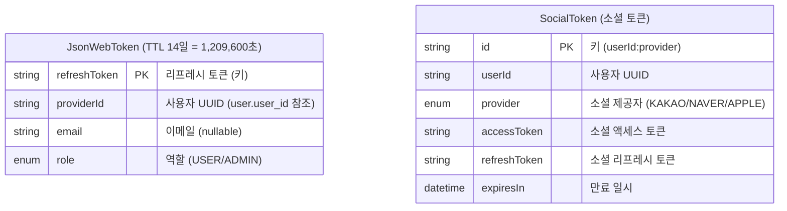

# DigDa ERD (Entity Relationship Diagram)

> 총 **39개 MySQL 테이블** + **2개 Redis 엔티티**
> `user`·`group_room` 두 축을 중심으로 일정/일기/할일/댓글, 그룹 캐릭터(모찌)·퀴즈·상점, 칭호,
> 신고/차단/숨김, 고객센터 문의, 비로그인 삭제 요청, 그리고 어드민(자격증명/공지/감사 로그/앱 설정)이 붙는다.
>
> _이 문서는 `dev` 브랜치의 JPA 엔티티에서 재생성되었습니다 (기준일 2026-06-17)._

---

## Mermaid ERD

```mermaid
erDiagram
    user["user (사용자)"] {
        binary_16 user_id PK "사용자 UUID"
        varchar social_id "소셜 고유 ID (nullable — 관리자는 null)"
        varchar email "이메일 (nullable)"
        varchar name "소셜 원본 이름 (최대 20자)"
        varchar display_name "표시 이름 (사용자 지정, nullable)"
        varchar profile_image "프로필 이미지 URL (nullable)"
        enum social_provider "제공자 (KAKAO/NAVER/APPLE/ADMIN)"
        enum role "역할 (USER/ADMIN)"
        boolean restricted "서비스 이용 제한 여부"
        datetime created_at "가입일"
        datetime updated_at "수정일"
    }

    user_terms["user_terms (약관 동의)"] {
        bigint user_terms_id PK "약관 동의 ID"
        binary_16 user_id FK,UK "사용자 UUID"
        boolean terms_of_service "이용약관 (필수)"
        boolean privacy_policy "개인정보처리방침 (필수)"
        boolean age_confirmation "14세 이상 확인"
        boolean marketing_consent "마케팅 수신 (선택)"
        boolean push_consent "푸시 알림 (선택)"
        datetime agreed_at "동의 일시"
    }

    user_notification_setting["user_notification_setting (알림 설정)"] {
        bigint user_notification_setting_id PK "알림 설정 ID"
        binary_16 user_id FK,UK "사용자 UUID"
        boolean push_enabled "푸시 전체 ON/OFF"
        boolean schedule_notification "일정 알림"
        boolean diary_notification "일기 알림"
        boolean comment_notification "댓글 알림"
        boolean marketing_consent "마케팅 수신"
    }

    user_privacy_setting["user_privacy_setting (개인정보 설정)"] {
        bigint user_privacy_setting_id PK "설정 ID"
        binary_16 user_id FK,UK "사용자 UUID"
        boolean profile_public "프로필 공개"
        boolean activity_visible "활동 표시"
    }

    group_room["group_room (그룹방)"] {
        bigint group_room_id PK "그룹방 ID"
        varchar name "그룹방명 (2~20자)"
        varchar thumbnail_image "썸네일 URL (nullable)"
        int max_members "최대 인원"
        binary_16 owner_id FK "방장 UUID"
        datetime last_activity_at "마지막 활동"
        datetime delete_scheduled_at "삭제 예약 (24h)"
        datetime deleted_at "삭제 일시 (Soft Delete)"
        datetime created_at "생성일"
        datetime updated_at "수정일"
    }

    membership["membership (그룹방 소속)"] {
        bigint membership_id PK "소속 ID"
        binary_16 user_id FK "사용자 UUID"
        bigint group_room_id FK "그룹방 ID"
        enum role "역할 (OWNER/MEMBER)"
        varchar color "사용자 색상 (#RRGGBB)"
        datetime joined_at "가입 일시"
    }

    invite_code["invite_code (초대 코드)"] {
        bigint invite_code_id PK "초대 코드 ID"
        bigint group_room_id FK "그룹방 ID"
        varchar code UK "초대 코드 (6자리)"
        datetime expires_at "만료 일시"
        datetime created_at "생성 일시"
    }

    schedule["schedule (일정)"] {
        bigint schedule_id PK "일정 ID"
        bigint group_room_id FK "그룹방 ID"
        varchar title "제목 (최대 50자)"
        varchar color "색상 (#RRGGBB)"
        date start_date "시작일"
        date end_date "종료일"
        time start_time "시작 시간 (nullable)"
        time end_time "종료 시간 (nullable)"
        boolean all_day "종일 여부"
        binary_16 created_by FK "작성자 UUID"
        datetime created_at "생성일"
        datetime updated_at "수정일"
    }

    schedule_participant["schedule_participant (일정 참여자)"] {
        bigint schedule_participant_id PK "참여자 ID"
        bigint schedule_id FK "일정 ID"
        binary_16 user_id FK "사용자 UUID"
    }

    diary["diary (일기)"] {
        bigint diary_id PK "일기 ID"
        bigint group_room_id FK "그룹방 ID"
        varchar title "제목 (최대 20자)"
        varchar content "내용 (최대 300자)"
        date date "일기 날짜"
        int weather "날씨 (0~3)"
        int mood "기분 (0~3)"
        varchar location "위치 표시명 (nullable)"
        varchar region_key "정규 지역 키 (시그니처 지도, nullable)"
        varchar region_sido "표시용 시도명 (nullable)"
        varchar region_sigungu "표시용 시군구명 (nullable)"
        binary_16 created_by FK "작성자 UUID"
        datetime created_at "생성일"
        datetime updated_at "수정일"
    }

    diary_image["diary_image (일기 이미지)"] {
        bigint diary_image_id PK "이미지 ID"
        bigint diary_id FK "일기 ID"
        varchar url "이미지 URL"
        int sort_order "정렬 순서 (0..N)"
        datetime created_at "생성 일시"
    }

    diary_like["diary_like (일기 좋아요)"] {
        bigint diary_like_id PK "좋아요 ID"
        bigint diary_id FK "일기 ID"
        binary_16 user_id FK "사용자 UUID"
        datetime created_at "생성 일시"
    }

    diary_reaction["diary_reaction (일기 이모지 리액션)"] {
        bigint diary_reaction_id PK "리액션 ID"
        bigint diary_id FK "일기 ID"
        binary_16 user_id FK "사용자 UUID"
        enum reaction_type "리액션 (HEART/CRY/SPARKLE/LAUGH/FIRE)"
        datetime created_at "생성 일시"
    }

    group_region_fill["group_region_fill (지역 채움 override)"] {
        bigint group_region_fill_id PK "채움 ID"
        bigint group_room_id "그룹방 ID (논리 참조)"
        varchar region_key "정규 지역 키"
        datetime created_at "생성일"
        datetime updated_at "수정일"
    }

    comment["comment (댓글)"] {
        bigint comment_id PK "댓글 ID"
        enum target_type "대상 (SCHEDULE/DIARY)"
        bigint target_id "대상 ID"
        varchar text "내용 (최대 200자)"
        binary_16 created_by FK "작성자 UUID"
        datetime created_at "작성 일시"
    }

    todo["todo (할 일)"] {
        bigint todo_id PK "할 일 ID"
        bigint group_room_id FK "그룹방 ID"
        varchar text "내용 (최대 100자)"
        boolean completed "완료 여부"
        datetime completed_at "완료 일시 (nullable)"
        binary_16 completed_by FK "완료자 UUID (nullable)"
        binary_16 created_by FK "작성자 UUID"
        datetime created_at "작성 일시"
    }

    notification["notification (알림)"] {
        bigint notification_id PK "알림 ID"
        binary_16 user_id FK "수신자 UUID"
        enum type "알림 유형 (NotificationType)"
        varchar title "제목"
        varchar message "메시지"
        bigint group_room_id "관련 그룹방 ID (nullable)"
        varchar group_room_name "관련 그룹방명 (nullable)"
        bigint related_id "관련 리소스 ID (nullable)"
        varchar related_type "관련 리소스 유형 (nullable)"
        boolean is_read "읽음 여부"
        datetime created_at "생성 일시"
    }

    device["device (디바이스)"] {
        bigint device_id PK "디바이스 ID"
        binary_16 user_id FK "사용자 UUID"
        varchar token UK "FCM 토큰"
        enum platform "플랫폼 (IOS/ANDROID)"
        datetime created_at "등록일"
        datetime updated_at "수정일"
    }

    uploaded_image["uploaded_image (업로드 이미지)"] {
        bigint uploaded_image_id PK "이미지 ID"
        binary_16 user_id FK "업로더 UUID"
        varchar url "이미지 URL (S3)"
        int width "가로 (px)"
        int height "세로 (px)"
        enum purpose "용도 (PROFILE/GROUP_THUMBNAIL/DIARY/QUIZ)"
        datetime created_at "업로드 일시"
    }

    user_block["user_block (사용자 차단)"] {
        bigint user_block_id PK "차단 ID"
        binary_16 blocker_id FK "차단 주체 UUID"
        binary_16 blocked_id FK "차단 대상 UUID"
        datetime created_at "차단 일시"
    }

    content_hide["content_hide (개별 콘텐츠 숨김)"] {
        bigint content_hide_id PK "숨김 ID"
        binary_16 user_id "숨긴 주체 UUID (논리 참조)"
        enum target_type "대상 (DIARY/COMMENT/SCHEDULE)"
        bigint target_id "대상 ID"
        enum reason "사유 (REPORTED/HIDDEN)"
        datetime created_at "숨김 일시"
    }

    report["report (신고)"] {
        bigint report_id PK "신고 ID"
        binary_16 reporter_id FK "신고자 UUID"
        enum target_type "대상 (DIARY/COMMENT/SCHEDULE/USER)"
        varchar target_id "대상 ID (Long 또는 UUID)"
        bigint group_room_id "관련 그룹방 ID (nullable)"
        enum reason "사유 (SPAM/ABUSE/SEXUAL/VIOLENCE/PRIVACY/ETC)"
        varchar detail "상세 (nullable)"
        enum status "상태 (PENDING/RESOLVED/DISMISSED)"
        datetime created_at "신고 일시"
        datetime reviewed_at "처리 일시 (nullable)"
    }

    inquiry["inquiry (고객센터 문의)"] {
        bigint inquiry_id PK "문의 ID"
        binary_16 user_id FK "작성자 UUID"
        varchar content "문의 내용 (최대 1000자)"
        enum status "상태 (PENDING/ANSWERED)"
        varchar answer "어드민 답변 (nullable, 최대 2000자)"
        datetime created_at "작성 일시"
        datetime answered_at "답변 일시 (nullable)"
    }

    deletion_request["deletion_request (계정/데이터 삭제 요청)"] {
        bigint deletion_request_id PK "요청 ID"
        enum type "유형 (ACCOUNT/DATA)"
        varchar email "본인 확인 이메일"
        varchar group_room_name "그룹방명 (DATA일 때, nullable)"
        varchar content "삭제 데이터 설명 (DATA일 때, nullable)"
        enum status "상태 (PENDING/DONE)"
        datetime created_at "접수 일시"
        datetime handled_at "처리 일시 (nullable)"
    }

    group_character["group_character (그룹 캐릭터 모찌)"] {
        bigint group_character_id PK "캐릭터 ID"
        bigint group_room_id FK,UK "그룹방 ID (1:1)"
        enum stage "단계 (EGG/SPROUT/BLOOM/BLOSSOM/GLOW/MASTER)"
        int level "레벨 (1~20)"
        int exp "현재 레벨 내 경험치"
        int coin "보유 코인"
        boolean diko_unlocked "디코 해금 (Lv.10)"
        boolean master_unlocked "마스터 진화 시험 통과"
        date ad_reward_date "광고 보상 마지막 적립일 (nullable)"
        int ad_reward_count "당일 광고 보상 횟수"
        datetime created_at "생성일"
        datetime updated_at "수정일"
    }

    character_quiz["character_quiz (모찌 퀴즈)"] {
        bigint character_quiz_id PK "퀴즈 ID"
        bigint group_room_id FK "그룹방 ID"
        binary_16 author_id FK "작성자 UUID (탈퇴 시 null)"
        enum category "분류 (PERSONAL/MEMORY/HOBBY/FAVORITE/GENERAL)"
        varchar question "문제 (최대 200자)"
        varchar option1 "선택지 1"
        varchar option2 "선택지 2"
        varchar option3 "선택지 3"
        varchar option4 "선택지 4"
        int correct_index "정답 인덱스"
        int exp_multiplier "EXP 배수 (1~3)"
        varchar image_url "이미지 퀴즈 URL (nullable)"
        datetime created_at "생성 일시"
    }

    character_quiz_attempt["character_quiz_attempt (퀴즈 응시)"] {
        bigint character_quiz_attempt_id PK "응시 ID"
        bigint quiz_id FK "퀴즈 ID"
        binary_16 user_id FK "응시자 UUID"
        int selected_index "선택 인덱스"
        boolean correct "정답 여부"
        int earned_exp "획득 EXP"
        int earned_coin "획득 코인"
        datetime attempted_at "응시 일시"
    }

    shop_item["shop_item (상점 아이템 마스터)"] {
        bigint shop_item_id PK "아이템 ID"
        varchar item_key UK "아이템 키 (식별자)"
        enum item_type "카테고리 (SKIN/HAT/GLASSES/HAIRPIN/ACCESSORY/MISC)"
        varchar display_name "표시명"
        varchar description "설명 (nullable)"
        int cost "코인 가격"
        varchar asset_key "렌더 asset 키"
        varchar accent_color "강조색 (nullable)"
        int layer_order "z-order"
        int sort_order "정렬 순서"
        boolean is_default "기본 지급/장착 여부"
        boolean enabled "상점 노출 여부"
        datetime created_at "생성일"
        datetime updated_at "수정일"
    }

    group_character_item["group_character_item (그룹 보유 아이템)"] {
        bigint group_character_item_id PK "보유 ID"
        bigint group_room_id FK "그룹방 ID"
        bigint shop_item_id FK "아이템 ID"
        int price_paid "구매 당시 지불 코인"
        datetime acquired_at "획득 일시"
    }

    group_character_equipped["group_character_equipped (그룹 장착 상태)"] {
        bigint group_character_equipped_id PK "장착 ID"
        bigint group_room_id FK "그룹방 ID"
        enum item_type "카테고리 슬롯 (ShopItemType)"
        bigint shop_item_id FK "장착 아이템 ID"
        datetime updated_at "수정 일시"
    }

    title_catalog["title_catalog (칭호 카탈로그)"] {
        bigint title_catalog_id PK "카탈로그 ID"
        varchar code UK "칭호 코드"
        varchar name "이름"
        varchar description "설명"
        varchar category "분류 (region/diary/character)"
        varchar accent_color "강조색"
        varchar icon_key "아이콘 키"
        varchar condition_type "획득 조건 종류"
        varchar condition_value "조건 파라미터 (nullable)"
        int sort_order "정렬 순서"
        datetime created_at "생성일"
        datetime updated_at "수정일"
    }

    user_title["user_title (획득 칭호)"] {
        bigint user_title_id PK "보유 칭호 ID"
        binary_16 user_id "사용자 UUID (논리 참조)"
        varchar code "칭호 코드"
        bigint group_room_id "획득 당시 그룹방 ID (nullable)"
        varchar group_room_name "획득 당시 그룹방명 스냅샷 (nullable)"
        datetime earned_at "획득 일시"
        datetime created_at "생성일"
        datetime updated_at "수정일"
    }

    group_equipped_title["group_equipped_title (그룹 장착 칭호)"] {
        bigint group_equipped_title_id PK "장착 ID"
        bigint group_room_id UK "그룹방 ID (논리 참조)"
        varchar code "칭호 코드"
        binary_16 equipped_by "장착자 UUID"
        datetime created_at "생성일"
        datetime updated_at "수정일"
    }

    nickname_exhibit["nickname_exhibit (역대 별명 전시관 카드)"] {
        bigint nickname_exhibit_id PK "카드 ID"
        varchar nickname "별명 (최대 100자)"
        varchar image_url "이미지 URL (nullable)"
        text history "별명 유래/설명"
        int sort_order "정렬 순서"
        datetime created_at "생성일"
        datetime updated_at "수정일"
    }

    nickname_exhibit_access["nickname_exhibit_access (전시관 접근 권한)"] {
        bigint nickname_exhibit_access_id PK "권한 ID"
        binary_16 user_id FK,UK "사용자 UUID"
        datetime created_at "생성일"
        datetime updated_at "수정일"
    }

    app_config["app_config (앱 운영 설정, 단일 행)"] {
        bigint app_config_id PK "설정 ID"
        boolean notice_enabled "대공지 노출"
        varchar notice_message "대공지 메시지 (최대 200자)"
        boolean feedback_enabled "피드백 노출"
        varchar feedback_url "피드백 URL (최대 500자)"
        datetime created_at "생성일"
        datetime updated_at "수정일"
    }

    admin_credential["admin_credential (관리자 자격증명)"] {
        bigint admin_credential_id PK "자격증명 ID"
        binary_16 user_id FK,UK "사용자 UUID (role=ADMIN)"
        varchar email UK "관리자 이메일"
        varchar password "BCrypt 해시"
        datetime created_at "생성일"
        datetime updated_at "수정일"
    }

    user_action_log["user_action_log (유저 행동 로그)"] {
        bigint user_action_log_id PK "로그 ID"
        binary_16 actor_id "행위자 UUID (시스템 로그는 null)"
        enum action "액션 (UserAction)"
        varchar target_type "대상 타입 (nullable)"
        varchar target_id "대상 ID (nullable)"
        varchar detail "상세 (최대 500자, nullable)"
        datetime created_at "기록 일시"
    }

    announcement["announcement (공지 발송 이력)"] {
        bigint announcement_id PK "공지 ID"
        varchar title "제목 (최대 100자)"
        varchar body "본문 (최대 1000자)"
        enum target_type "대상 (ALL/USER_IDS)"
        int recipient_count "수신자 수"
        datetime created_at "발송 일시"
        datetime updated_at "수정 일시"
    }

    %% ── 관계 (FK 매핑) ──
    user ||--o| user_terms : "약관 동의"
    user ||--o| user_notification_setting : "알림 설정"
    user ||--o| user_privacy_setting : "개인정보 설정"
    user ||--o| admin_credential : "관리자 계정"
    user ||--o| nickname_exhibit_access : "전시관 접근"

    user ||--o{ membership : "그룹방 소속"
    user ||--o{ device : "디바이스"
    user ||--o{ notification : "알림 수신"
    user ||--o{ uploaded_image : "이미지 업로드"
    user ||--o{ comment : "댓글 작성"
    user ||--o{ inquiry : "문의 작성"
    user ||--o{ report : "신고 (reporter)"
    user ||--o{ diary_like : "좋아요"
    user ||--o{ diary_reaction : "리액션"
    user ||--o{ character_quiz : "퀴즈 작성 (author)"
    user ||--o{ character_quiz_attempt : "퀴즈 응시"
    user ||--o{ user_block : "차단 (blocker)"

    group_room }o--|| user : "방장 (owner)"
    group_room ||--o{ membership : "구성원"
    group_room ||--o{ invite_code : "초대 코드"
    group_room ||--o{ schedule : "일정"
    group_room ||--o{ diary : "일기"
    group_room ||--o{ todo : "할 일"
    group_room ||--o| group_character : "그룹 캐릭터"
    group_room ||--o{ character_quiz : "퀴즈"
    group_room ||--o{ group_character_item : "보유 아이템"
    group_room ||--o{ group_character_equipped : "장착 슬롯"

    schedule ||--o{ schedule_participant : "참여자"
    schedule_participant }o--|| user : "참여 사용자"
    schedule }o--|| user : "작성자"

    diary ||--o{ diary_image : "이미지"
    diary ||--o{ diary_like : "좋아요"
    diary ||--o{ diary_reaction : "리액션"
    diary }o--|| user : "작성자"

    todo }o--|| user : "작성자"
    todo }o--o| user : "완료자"

    character_quiz ||--o{ character_quiz_attempt : "응시"
    shop_item ||--o{ group_character_item : "보유"
    shop_item ||--o{ group_character_equipped : "장착"
```

> 일부 테이블(`user_title`, `group_equipped_title`, `content_hide`, `group_region_fill`,
> `user_action_log`)은 JPA 연관관계 없이 **id 컬럼으로만 논리 참조**한다 — 그룹/탈퇴와 수명을
>분리하거나(칭호 보존), 다형 대상(신고·숨김)을 다루기 위해서다.

---

## Redis Entities (비관계형)

> JWT 리프레시 토큰과 소셜 토큰을 Redis에 저장해 빠른 조회/만료(TTL)를 처리한다.

---

## 테이블 요약 (39개)

### 사용자 · 인증

| # | 테이블 | 설명 | 주요 관계 |
|---|--------|------|-----------|
| 1 | `user` | 사용자 (중심 엔티티, PK=UUID, UK=social_id+social_provider) | — |
| 2 | `user_terms` | 약관 동의 내역 | user 1:1 |
| 3 | `user_notification_setting` | 알림 설정 | user 1:1 |
| 4 | `user_privacy_setting` | 개인정보 설정 | user 1:1 |
| 5 | `admin_credential` | 관리자 자격증명 (BCrypt) | user 1:1 |

### 그룹방 · 일정/일기/할일

| # | 테이블 | 설명 | 주요 관계 |
|---|--------|------|-----------|
| 6 | `group_room` | 그룹방 (다이어리 방, Soft Delete 24h) | user N:1 (방장) |
| 7 | `membership` | 그룹방 소속 관계 (role·color) | user N:1, group_room N:1 |
| 8 | `invite_code` | 초대 코드 (6자리, 만료) | group_room N:1 |
| 9 | `schedule` | 일정 | group_room N:1, user N:1 |
| 10 | `schedule_participant` | 일정 참여자 | schedule N:1, user N:1 |
| 11 | `diary` | 일기 (날씨/기분/지역 포함) | group_room N:1, user N:1 |
| 12 | `diary_image` | 일기 이미지 (정렬순) | diary 1:N |
| 13 | `diary_like` | 일기 좋아요 | diary N:1, user N:1 |
| 14 | `diary_reaction` | 일기 이모지 리액션 | diary N:1, user N:1 |
| 15 | `group_region_fill` | 시그니처 지도 채움 override (어드민) | group_room (논리 참조) |
| 16 | `comment` | 댓글 (일정/일기 공용, 다형) | user N:1 |
| 17 | `todo` | 할 일 (완료/완료자) | group_room N:1, user N:1 |

### 캐릭터(모찌) · 상점 · 칭호

| # | 테이블 | 설명 | 주요 관계 |
|---|--------|------|-----------|
| 18 | `group_character` | 그룹 공용 캐릭터(모찌) — 레벨/코인/단계 | group_room 1:1 |
| 19 | `character_quiz` | 모찌 퀴즈 (4지선다) | group_room N:1, user N:1 (author) |
| 20 | `character_quiz_attempt` | 퀴즈 응시 기록 (1회 제한) | quiz N:1, user N:1 |
| 21 | `shop_item` | 상점 아이템 마스터 (전 그룹 공통, 시드) | — |
| 22 | `group_character_item` | 그룹별 보유 아이템 | group_room N:1, shop_item N:1 |
| 23 | `group_character_equipped` | 그룹 장착 상태 (카테고리당 1) | group_room N:1, shop_item N:1 |
| 24 | `title_catalog` | 칭호 카탈로그 (마스터 데이터, 시드) | — |
| 25 | `user_title` | 사용자 획득 칭호 (계정 소속) | user (논리 참조) |
| 26 | `group_equipped_title` | 그룹 모찌 장착 칭호 (그룹당 1) | group_room (논리 참조) |

### 신고 · 차단 · 운영

| # | 테이블 | 설명 | 주요 관계 |
|---|--------|------|-----------|
| 27 | `report` | 사용자 신고 기록 | user N:1 (reporter) |
| 28 | `user_block` | 사용자 차단 (단방향·전역) | user N:1 (blocker/blocked) |
| 29 | `content_hide` | 개별 콘텐츠 숨김 (다형) | user (논리 참조) |
| 30 | `inquiry` | 고객센터 문의 (답변) | user N:1 |
| 31 | `deletion_request` | 비로그인 계정/데이터 삭제 요청 | (독립) |
| 32 | `nickname_exhibit` | 역대 별명 전시관 카드 | (독립) |
| 33 | `nickname_exhibit_access` | 전시관 접근 권한 | user 1:1 |
| 34 | `app_config` | 앱 운영 설정 (단일 행, 대공지/피드백) | (독립) |
| 35 | `announcement` | 관리자 공지 발송 이력 | (독립) |
| 36 | `user_action_log` | 유저 행동 감사 로그 | user (논리 참조, actor) |

### 공통 · 인프라

| # | 테이블 | 설명 | 주요 관계 |
|---|--------|------|-----------|
| 37 | `notification` | 인앱 알림 | user N:1 |
| 38 | `device` | 디바이스 (FCM 푸시용) | user N:1 |
| 39 | `uploaded_image` | 업로드 이미지 (S3) | user N:1 |

---

## Enum 목록

| Enum | 값 | 사용처 |
|------|----|--------|
| `SocialProvider` | KAKAO, NAVER, APPLE, ADMIN | user.social_provider |
| `Role` | USER, ADMIN | user.role |
| `GroupRoomRole` | OWNER, MEMBER | membership.role |
| `Platform` | IOS, ANDROID | device.platform |
| `CommentTargetType` | SCHEDULE, DIARY | comment.target_type |
| `ImagePurpose` | PROFILE, GROUP_THUMBNAIL, DIARY, QUIZ | uploaded_image.purpose |
| `DiaryReactionType` | HEART, CRY, SPARKLE, LAUGH, FIRE | diary_reaction.reaction_type |
| `CharacterStage` | EGG(Lv.1), SPROUT(3), BLOOM(6), BLOSSOM(10), GLOW(15), MASTER(20) | group_character.stage |
| `QuizCategory` | PERSONAL, MEMORY, HOBBY, FAVORITE, GENERAL | character_quiz.category |
| `ShopItemType` | SKIN, HAT, GLASSES, HAIRPIN, ACCESSORY, MISC | shop_item.item_type |
| `ReportTargetType` | DIARY, COMMENT, SCHEDULE, USER | report.target_type |
| `ReportReason` | SPAM, ABUSE, SEXUAL, VIOLENCE, PRIVACY, ETC | report.reason |
| `ReportStatus` | PENDING, RESOLVED, DISMISSED | report.status |
| `HideTargetType` | DIARY, COMMENT, SCHEDULE | content_hide.target_type |
| `HideReason` | REPORTED, HIDDEN | content_hide.reason |
| `InquiryStatus` | PENDING, ANSWERED | inquiry.status |
| `DeletionRequestType` | ACCOUNT, DATA | deletion_request.type |
| `DeletionRequestStatus` | PENDING, DONE | deletion_request.status |
| `AnnouncementTarget` | ALL, USER_IDS | announcement.target_type |
| `NotificationType` | SCHEDULE_CREATED, SCHEDULE_UPDATED, SCHEDULE_DAY_BEFORE, SCHEDULE_TODAY, DIARY_WRITTEN, COMMENT_ON_SCHEDULE, COMMENT_ON_DIARY, MEMBER_JOINED, MEMBER_LEFT, MEMBER_REMOVED, OWNERSHIP_TRANSFERRED, GROUP_DELETE_SCHEDULED, QUIZ_CREATED, QUIZ_ANSWERED, MOCHI_LEVELUP, DIKO_UNLOCKED, ANNOUNCEMENT | notification.type |
| `UserAction` | LOGIN, SIGNUP, LOGOUT, CREATE_DIARY, DELETE_DIARY, CREATE_SCHEDULE, DELETE_SCHEDULE, CREATE_COMMENT, CREATE_GROUP_ROOM, JOIN_GROUP_ROOM, LEAVE_GROUP_ROOM, REMOVE_MEMBER, TRANSFER_OWNER, CREATE_TODO, REPORT, BLOCK_USER, UNBLOCK_USER, HIDE_CONTENT, OTHER | user_action_log.action |

> `NotificationType`은 JSON 직렬화 시 소문자(`schedule_created`)로 노출된다.
