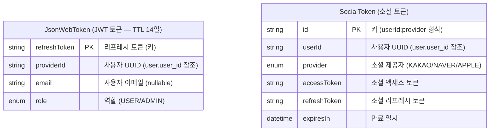

# DigDa ERD (Entity Relationship Diagram)

> 총 **18개 MySQL 테이블** + **2개 Redis 엔티티**
> `user`를 중심으로 그룹방 → 일정/일기/할일 구조 + 어드민(`admin_credential`) / 감사 로그(`user_action_log`) / 공지(`announcement`)

---

## Mermaid ERD

```mermaid
erDiagram
    user["user (사용자)"] {
        binary_16 user_id PK "사용자 UUID"
        varchar social_id "소셜 고유 ID (nullable — 관리자는 null)"
        enum social_provider "제공자 (KAKAO/NAVER/APPLE/ADMIN)"
        varchar email "이메일 (nullable)"
        varchar name "닉네임 (2~20자)"
        varchar profile_image "프로필 이미지 URL"
        varchar status_message "상태 메시지 (최대 100자)"
        enum role "역할 (USER/ADMIN)"
        datetime created_at "가입일"
        datetime updated_at "수정일"
    }

    user_terms["user_terms (약관 동의)"] {
        bigint user_terms_id PK "약관 동의 ID"
        binary_16 user_id FK "사용자 UUID"
        boolean terms_of_service "이용약관 동의 (필수)"
        boolean privacy_policy "개인정보처리방침 (필수)"
        boolean age_confirmation "14세 이상 확인 (필수)"
        boolean marketing_consent "마케팅 수신 동의 (선택)"
        boolean push_consent "푸시 알림 동의 (선택)"
        datetime agreed_at "동의 일시"
    }

    user_notification_setting["user_notification_setting (알림 설정)"] {
        bigint id PK "알림 설정 ID"
        binary_16 user_id FK "사용자 UUID"
        boolean push_enabled "푸시 알림 전체 ON/OFF"
        boolean schedule_notification "일정 알림"
        boolean diary_notification "일기 알림"
        boolean comment_notification "댓글 알림"
        boolean marketing_consent "마케팅 수신 동의"
    }

    user_privacy_setting["user_privacy_setting (개인정보 설정)"] {
        bigint id PK "개인정보 설정 ID"
        binary_16 user_id FK "사용자 UUID"
        boolean profile_public "프로필 공개 여부"
        boolean activity_visible "활동 표시 여부"
    }

    group_room["group_room (그룹방)"] {
        bigint group_room_id PK "그룹방 ID"
        varchar name "그룹방명 (2~20자)"
        varchar thumbnail_image "썸네일 이미지 URL"
        int max_members "최대 인원"
        binary_16 owner_id FK "방장 사용자 UUID"
        datetime last_activity_at "마지막 활동 일시"
        datetime delete_scheduled_at "삭제 예약 일시"
        datetime deleted_at "삭제 일시 (Soft Delete)"
        datetime created_at "생성일"
        datetime updated_at "수정일"
    }

    membership["membership (그룹방 소속)"] {
        bigint membership_id PK "소속 ID"
        binary_16 user_id FK "사용자 UUID"
        bigint group_room_id FK "그룹방 ID"
        enum role "그룹방 역할 (OWNER/MEMBER)"
        varchar color "사용자 색상 (#FFFFFF)"
        datetime joined_at "가입 일시"
    }

    invite_code["invite_code (초대 코드)"] {
        bigint invite_code_id PK "초대 코드 ID"
        bigint group_room_id FK "그룹방 ID"
        varchar code UK "초대 코드 (6자리)"
        datetime expires_at "만료 일시"
        datetime created_at "생성 일시"
    }

    schedule["schedule (일정)"] {
        bigint schedule_id PK "일정 ID"
        bigint group_room_id FK "그룹방 ID"
        varchar title "일정 제목 (최대 50자)"
        varchar color "일정 색상 (#FFFFFF)"
        date start_date "시작일"
        date end_date "종료일"
        time start_time "시작 시간 (종일이면 null)"
        time end_time "종료 시간 (종일이면 null)"
        boolean all_day "종일 여부"
        binary_16 created_by FK "작성자 UUID"
        datetime created_at "생성일"
        datetime updated_at "수정일"
    }

    schedule_participant["schedule_participant (일정 참여자)"] {
        bigint id PK "참여자 ID"
        bigint schedule_id FK "일정 ID"
        binary_16 user_id FK "사용자 UUID"
    }

    diary["diary (일기)"] {
        bigint diary_id PK "일기 ID"
        bigint group_room_id FK "그룹방 ID"
        varchar title "일기 제목 (최대 20자)"
        varchar content "일기 내용 (최대 300자)"
        date date "일기 날짜"
        int weather "날씨 (0~3)"
        int mood "기분 (0~3)"
        varchar image_url "이미지 URL (nullable)"
        binary_16 created_by FK "작성자 UUID"
        datetime created_at "생성일"
        datetime updated_at "수정일"
    }

    comment["comment (댓글)"] {
        bigint comment_id PK "댓글 ID"
        enum target_type "대상 유형 (SCHEDULE/DIARY)"
        bigint target_id "대상 ID"
        varchar text "댓글 내용 (최대 200자)"
        binary_16 created_by FK "작성자 UUID"
        datetime created_at "작성 일시"
    }

    todo["todo (할 일)"] {
        bigint todo_id PK "할 일 ID"
        bigint group_room_id FK "그룹방 ID"
        varchar text "할 일 내용 (최대 100자)"
        boolean completed "완료 여부"
        datetime completed_at "완료 일시"
        binary_16 completed_by FK "완료한 사용자 UUID"
        binary_16 created_by FK "작성자 UUID"
        datetime created_at "작성 일시"
    }

    notification["notification (알림)"] {
        bigint notification_id PK "알림 ID"
        binary_16 user_id FK "수신자 UUID"
        enum type "알림 유형"
        varchar title "알림 제목"
        varchar message "알림 메시지"
        bigint group_room_id "관련 그룹방 ID"
        varchar group_room_name "관련 그룹방명"
        bigint related_id "관련 리소스 ID"
        varchar related_type "관련 리소스 유형"
        boolean is_read "읽음 여부"
        datetime created_at "생성 일시"
    }

    device["device (디바이스)"] {
        bigint device_id PK "디바이스 ID"
        binary_16 user_id FK "사용자 UUID"
        varchar token UK "FCM 토큰 (고유)"
        enum platform "플랫폼 (IOS/ANDROID)"
        datetime created_at "등록일"
        datetime updated_at "수정일"
    }

    uploaded_image["uploaded_image (업로드 이미지)"] {
        bigint uploaded_image_id PK "이미지 ID"
        binary_16 user_id FK "업로더 UUID"
        varchar url "이미지 URL"
        int width "가로 크기 (px)"
        int height "세로 크기 (px)"
        enum purpose "용도 (PROFILE/GROUP_THUMBNAIL/DIARY)"
        datetime created_at "업로드 일시"
    }

    admin_credential["admin_credential (관리자 자격증명)"] {
        bigint admin_credential_id PK "자격증명 ID"
        binary_16 user_id FK "사용자 UUID (1:1, role=ADMIN)"
        varchar email UK "관리자 이메일"
        varchar password "BCrypt 해시"
        datetime created_at "생성일"
        datetime updated_at "수정일"
    }

    user_action_log["user_action_log (유저 행동 로그)"] {
        bigint user_action_log_id PK "로그 ID"
        binary_16 actor_id "행위자 UUID (시스템 로그는 nullable)"
        enum action "액션 타입 (LOGIN/SIGNUP/LOGOUT/CREATE_DIARY/...)"
        varchar target_type "대상 타입 (USER/GROUP_ROOM/DIARY/SCHEDULE/COMMENT/TODO 등)"
        varchar target_id "대상 ID"
        varchar detail "상세 메시지 (최대 500자)"
        datetime created_at "기록 일시"
    }

    announcement["announcement (공지 발송 이력)"] {
        bigint announcement_id PK "공지 ID"
        varchar title "공지 제목 (최대 100자)"
        varchar body "공지 본문 (최대 1000자)"
        enum target_type "발송 대상 (ALL/USER_IDS)"
        int recipient_count "실제 발송 수신자 수"
        datetime created_at "발송 일시"
        datetime updated_at "수정 일시"
    }

    %% ── 관계 (Relationships) ──

    user ||--o| user_terms : "약관 동의"
    user ||--o| user_notification_setting : "알림 설정"
    user ||--o| user_privacy_setting : "개인정보 설정"

    user ||--o{ membership : "그룹방 소속"
    user ||--o{ device : "디바이스 등록"
    user ||--o{ notification : "알림 수신"
    user ||--o{ uploaded_image : "이미지 업로드"
    user ||--o{ comment : "댓글 작성"

    group_room ||--o{ membership : "구성원"
    group_room ||--o{ invite_code : "초대 코드"
    group_room ||--o{ schedule : "일정"
    group_room ||--o{ diary : "일기"
    group_room ||--o{ todo : "할 일"
    group_room }o--|| user : "방장"

    schedule }o--|| user : "작성자"
    schedule ||--o{ schedule_participant : "참여자"
    schedule_participant }o--|| user : "참여 사용자"

    diary }o--|| user : "작성자"

    todo }o--|| user : "작성자"
    todo }o--o| user : "완료자"

    user ||--o| admin_credential : "관리자 계정"
    user ||--o{ user_action_log : "행동 기록(actor)"
```

---

## Redis Entities (비관계형)

> JWT 토큰과 소셜 토큰을 Redis에 저장하여 빠른 조회/만료 처리

---

## 테이블 요약

| # | 테이블 | 설명 | 주요 관계 |
|---|--------|------|-----------|
| 1 | `user` | 사용자 (중심 엔티티, PK=UUID, UK=social_id+social_provider) | — |
| 2 | `user_terms` | 약관 동의 | user 1:1 |
| 3 | `user_notification_setting` | 알림 설정 | user 1:1 |
| 4 | `user_privacy_setting` | 개인정보 설정 | user 1:1 |
| 5 | `group_room` | 그룹방 (다이어리 방) | user N:1 (방장) |
| 6 | `membership` | 그룹방 소속 관계 | user N:1, group_room N:1 |
| 7 | `invite_code` | 초대 코드 (6자리, 만료) | group_room N:1 |
| 8 | `schedule` | 일정 | group_room N:1, user N:1 |
| 9 | `schedule_participant` | 일정 참여자 | schedule N:1, user N:1 |
| 10 | `diary` | 일기 (이미지 URL 직접 포함) | group_room N:1, user N:1 |
| 11 | `comment` | 댓글 (일정/일기 공용) | user N:1 |
| 12 | `todo` | 할 일 | group_room N:1, user N:1 |
| 13 | `notification` | 알림 | user N:1 |
| 14 | `device` | 디바이스 (FCM 푸시용) | user N:1 |
| 15 | `uploaded_image` | 업로드 이미지 (S3) | user N:1 |
| 16 | `admin_credential` | 관리자 자격증명 (BCrypt) | user 1:1 |
| 17 | `user_action_log` | 유저 행동 감사 로그 | user N:1 (actor, nullable) |
| 18 | `announcement` | 관리자 공지 발송 이력 | (독립) |

### Enum 목록

| Enum | 값 | 사용처 |
|------|----|--------|
| `SocialProvider` | KAKAO, NAVER, APPLE, ADMIN | user.social_provider |
| `Role` | USER, ADMIN | user.role |
| `GroupRoomRole` | OWNER, MEMBER | membership.role |
| `Platform` | IOS, ANDROID | device.platform |
| `CommentTargetType` | SCHEDULE, DIARY | comment.target_type |
| `ImagePurpose` | PROFILE, GROUP_THUMBNAIL, DIARY | uploaded_image.purpose |
| `NotificationType` | SCHEDULE_CREATED, SCHEDULE_UPDATED, DIARY_WRITTEN, COMMENT_ON_SCHEDULE, COMMENT_ON_DIARY, MEMBER_JOINED, MEMBER_LEFT, MEMBER_REMOVED, OWNERSHIP_TRANSFERRED, GROUP_DELETE_SCHEDULED, ANNOUNCEMENT | notification.type |
| `UserAction` | LOGIN, SIGNUP, LOGOUT, CREATE_DIARY, DELETE_DIARY, CREATE_SCHEDULE, DELETE_SCHEDULE, CREATE_COMMENT, CREATE_GROUP_ROOM, JOIN_GROUP_ROOM, LEAVE_GROUP_ROOM, TRANSFER_OWNER, CREATE_TODO, OTHER | user_action_log.action |
| `AnnouncementTarget` | ALL, USER_IDS | announcement.target_type |
